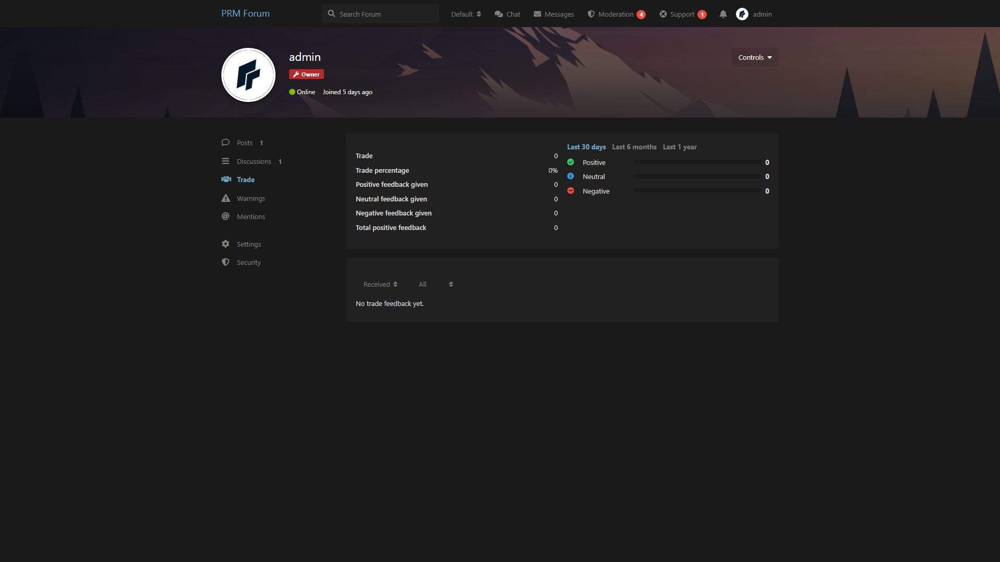

# Trade Feedback

Buyer / seller feedback with positive, neutral, and negative ratings.

Compatible with **Flarum 1.8**.

## Screenshot



## What it does

- **Trade** tab on every user profile
- Leave feedback as buyer, seller, or trade partner
- Scores: positive (+1), neutral (0), negative (−1)
- Stats: trade percentage, given/received counts, last 30 days / 6 months / 1 year
- Filters: received / given, all / positive / neutral / negative
- Notification when someone rates you
- Staff can edit or delete feedback

## Install

```bash
composer config repositories.prm-trade-feedback vcs https://github.com/smmpanelscripts1/prm-trade-feedback
composer require prm/trade-feedback:dev-main
```

Enable **Trade Feedback**, then:

```bash
php flarum migrate
php flarum cache:clear
```

## How to use

1. Admin → Permissions
   - **Give trade feedback** for members
   - **Moderate trade feedback** for staff
2. Open a user → **Options → Leave feedback**, or the **Trade** tab
3. Choose your role, rating, a short comment, and optional thread URL

Optional notice text under the form: Admin → Trade Feedback settings.

## License

MIT
